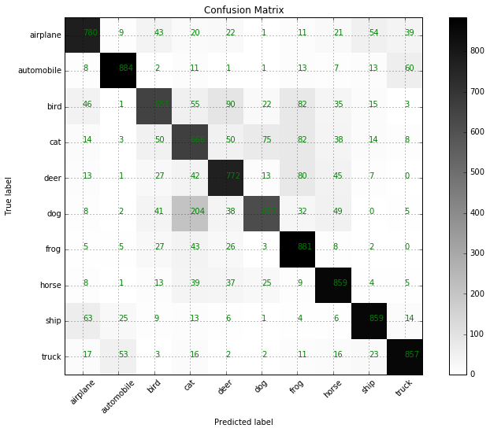
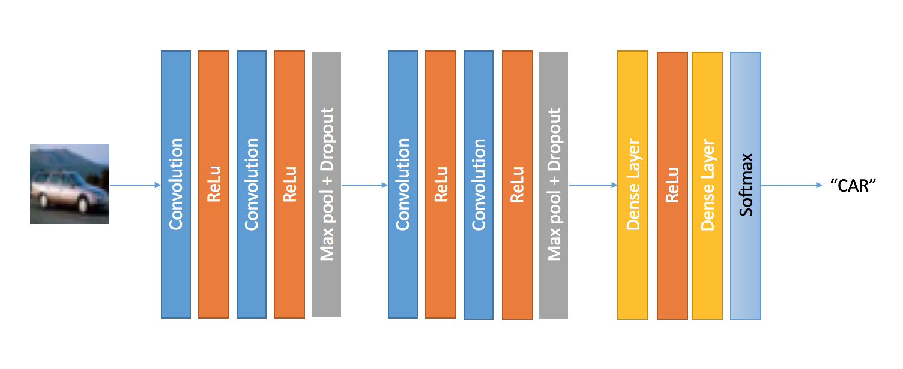

# CIFAR-10: Object Detection in Images #

This repository contains EE660 Machine Learning course project codes.

### About the dataset ###
CIFAR-10 is a tiny image dataset is provided by Krizhevsky and Hinton of University of Toronto [[link](https://www.cs.toronto.edu/~kriz/cifar.html)]. This has 60,000 32x32 RBG images are divided into 50,000 train and 10,000 test images. This dataset is smaller compared to other object detection datasets, but a good one to try different machine learning algorithms.

### Directory Descriptions ###

* *dataset*: Contains the datasets. 
* *keras*: CNN experiments scripts.
* *notebooks*: IPython notebooks of all experiments.
* *scripts*: Supporting scripts
* *misc*: Has some shell commands and scripts for AWS ami setup.   

### Key Results ###
| Algorithm |  Accuracy |
|:----------| --------:|
|HOG + RF + AdaBoost | 35%|
| HOG + SVM | 42%|
| CNN | 78%|

### CNN Confusion Matrix ###

### CNN Architecture ###

